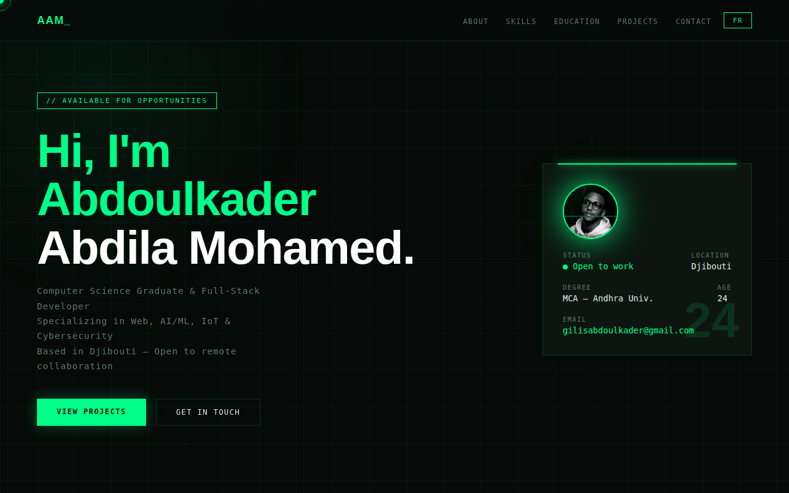
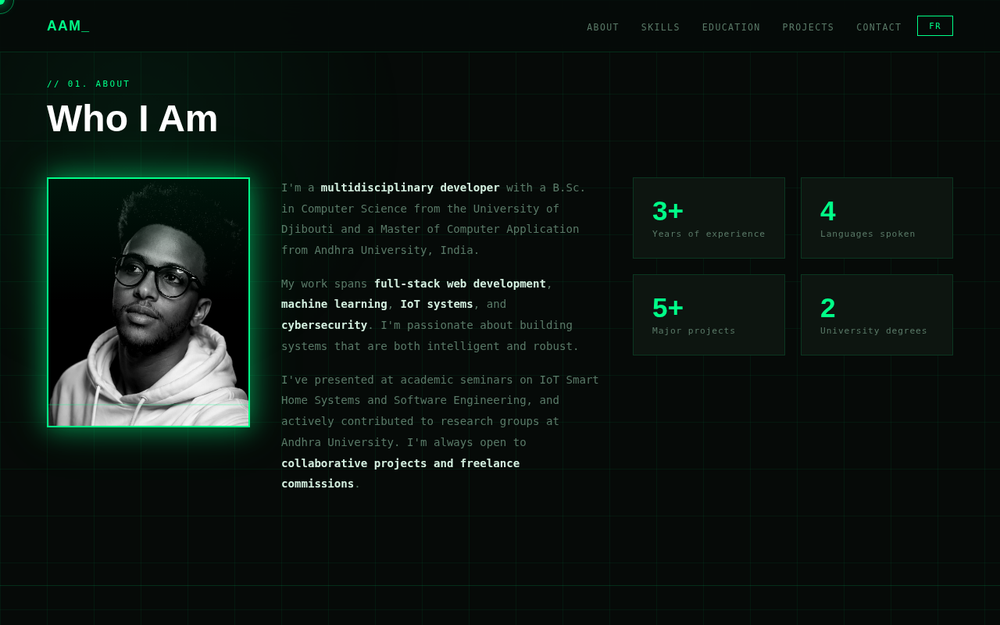
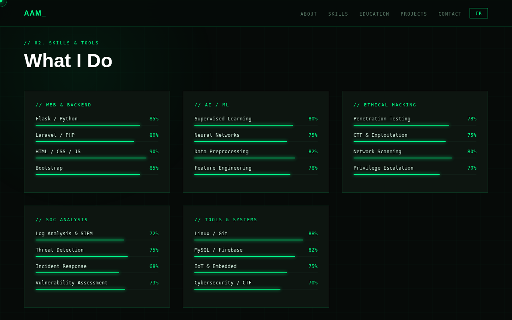
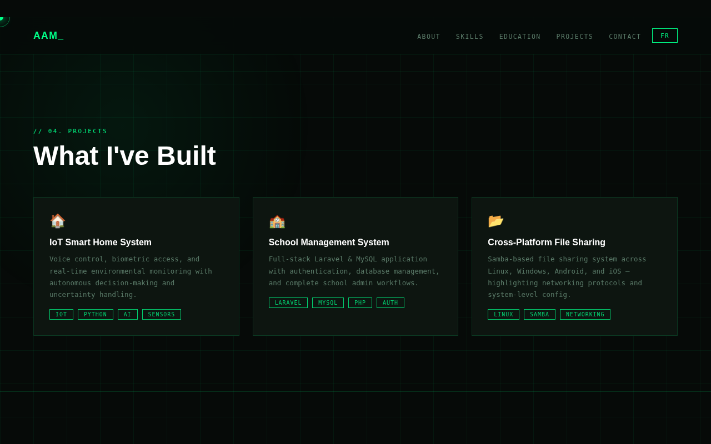
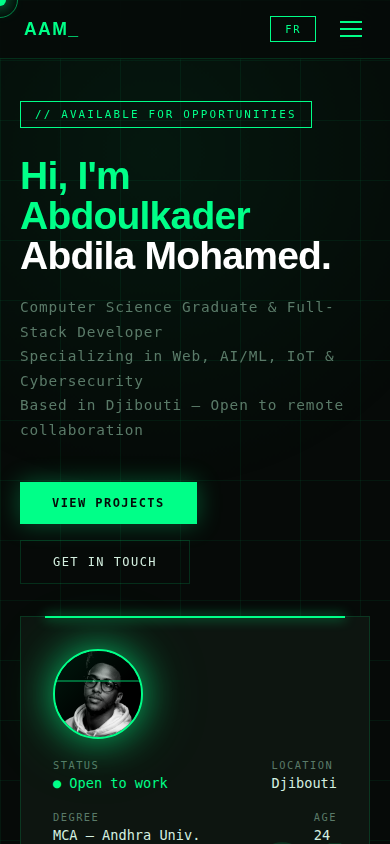

# 🖥️ Abdoulkader Abdila Mohamed — Personal Portfolio

> **Live Site:** [https://cyberpcmekla.netlify.app](https://cyberpcmekla.netlify.app)

A dark hacker-aesthetic personal portfolio website built with pure HTML, CSS & JavaScript. Bilingual (EN/FR), fully responsive, and optimized for mobile.

---

## 🖼️ Preview

### Hero Section


### About Me


### Skills & Tools


### Projects


### Mobile View


---

## ✨ Features

- 🌙 **Dark hacker aesthetic** — neon green (`#00ff88`) on deep black, animated grid background
- 🌍 **Bilingual** — EN / FR language switcher in the navbar, all sections fully translated
- 📱 **Fully responsive** — hamburger menu + stacked layout for Android & iOS
- 🖼️ **Profile photo** — appears in both hero card and About section with neon glow + scan-line animation
- 📊 **Animated skill bars** — scroll-triggered progress bars for all skill groups
- 📬 **EmailJS contact form** — messages sent directly to inbox, no backend needed
- ✨ **Scroll reveal animations** — sections fade in as you scroll
- 🖱️ **Custom cursor** — green dot + ring follows mouse on desktop
- 🔒 **Cybersecurity focused** — Ethical Hacking & SOC Analysis skill groups highlighted

---

## 🛠️ Tech Stack

| Technology | Purpose |
|---|---|
| HTML5 | Structure |
| CSS3 | Styling, animations, responsive layout |
| Vanilla JavaScript | Language switcher, scroll reveals, contact form |
| EmailJS | Contact form email delivery |
| Google Fonts | Space Mono + Syne typography |
| Netlify | Deployment & hosting |

---

## 📂 Sections

| Section | Description |
|---|---|
| **Hero** | Name, title, status card with photo, CTA buttons |
| **About** | Bio, large photo, stats (3+ years, 4 languages, 5+ projects, 2 degrees) |
| **Skills** | Web/Backend, AI/ML, Ethical Hacking, SOC Analysis, Tools & Systems |
| **Education** | Timeline — MCA Andhra University, BSc University of Djibouti, Google Certs |
| **Projects** | IoT Smart Home, School Management System, Cross-Platform File Sharing |
| **Contact** | EmailJS form + direct contact info |

---

## 🚀 How to Run Locally

```bash
# Clone the repository
git clone https://github.com/YOUR_USERNAME/portfolio.git

# Open in browser
open index.html
# or just drag index.html into your browser
```

No build tools, no npm install, no dependencies — just open `index.html`.

---

## 📧 Contact

- **Email:** gilisabdoulkader@gmail.com
- **Location:** Djibouti / Visakhapatnam, India
- **Live Portfolio:** [cyberpcmekla.netlify.app](https://cyberpcmekla.netlify.app)

---

## 📄 License

This project is open source and available under the [MIT License](LICENSE).

---

<p align="center">Built with 💚 by Abdoulkader Abdila Mohamed</p>
